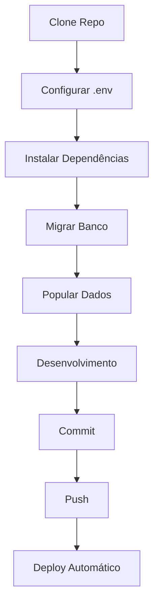

# 📁 Estrutura Organizada do Projeto

Documentação da estrutura de diretórios reorganizada do CG Bookstore.

---

## 🎯 Objetivos da Reorganização

1. ✅ Separar documentação de código
2. ✅ Organizar arquivos de configuração
3. ✅ Centralizar scripts de deploy
4. ✅ Melhorar navegabilidade
5. ✅ Manter compatibilidade com Render

---

## 📂 Estrutura Completa

```
cgbookstore_v3/
│
├── 📂 Django Apps (Código Principal)
│   ├── accounts/              # Autenticação e perfis
│   ├── cgbookstore/           # Settings do Django
│   ├── chatbot_literario/     # Chatbot IA
│   ├── core/                  # App principal
│   │   ├── management/        # Comandos Django
│   │   │   └── commands/
│   │   │       ├── setup_initial_data.py   # ⭐ Popular dados
│   │   │       └── health_check.py         # ⭐ Diagnóstico
│   │   ├── views/
│   │   │   └── admin_tools.py # ⭐ Ferramentas web
│   │   └── models/            # Models do sistema
│   ├── debates/               # Debates literários
│   ├── finance/               # Mercado Pago
│   └── recommendations/       # Recomendações IA
│
├── 📂 config/                 # ⭐ CONFIGURAÇÕES
│   ├── .env.example           # Template de variáveis
│   ├── requirements.txt       # Dependências Python
│   └── README.md              # Guia de configuração
│
├── 📂 deploy/                 # ⭐ DEPLOY
│   ├── render.yaml            # Config Render.com
│   ├── scripts/
│   │   └── build.sh           # Script de build
│   └── README.md              # Guia de deploy
│
├── 📂 docs/                   # ⭐ DOCUMENTAÇÃO
│   ├── deployment/            # Deploy e infraestrutura
│   │   ├── DEPLOY_RENDER.md
│   │   ├── RENDER_SETUP_GUIDE.md
│   │   └── PRODUCTION_CHECKLIST.md
│   ├── production/            # Guias de produção
│   │   ├── GUIA_RAPIDO_FREE.md
│   │   ├── CORRECOES_PRODUCAO.md
│   │   ├── README_PRODUCAO.md
│   │   └── RESUMO_CORRECOES.md
│   ├── setup/                 # Configuração inicial
│   │   └── CONFIGURAR_LOGIN_SOCIAL.md
│   ├── troubleshooting/       # Solução de problemas
│   │   └── TROUBLESHOOTING_PRODUCAO.md
│   └── INDEX.md               # Índice da documentação
│
├── 📂 templates/              # Templates Django
├── 📂 static/                 # CSS, JS, Images
├── 📂 media/                  # Uploads
│
├── 📄 manage.py               # CLI do Django
├── 📄 README.md               # README principal
├── 📄 ESTRUTURA_PROJETO.md    # Este arquivo
│
└── 🔗 Links de Compatibilidade (Render)
    ├── requirements.txt       → config/requirements.txt
    ├── build.sh               → deploy/scripts/build.sh
    └── render.yaml            → deploy/render.yaml
```

---

## 🗂️ Diretórios Principais

### 📂 config/

**Propósito:** Centralizar arquivos de configuração

**Conteúdo:**
- `.env.example` - Template de variáveis de ambiente
- `requirements.txt` - Dependências Python
- `README.md` - Guia de configuração

**Por que?**
- Separa configuração de código
- Facilita manutenção
- Documentação próxima aos arquivos

---

### 📂 deploy/

**Propósito:** Centralizar arquivos relacionados a deploy

**Conteúdo:**
- `render.yaml` - Configuração Render.com
- `scripts/build.sh` - Script de build
- `README.md` - Guia de deploy

**Por que?**
- Organiza infraestrutura
- Facilita CI/CD
- Documentação de deploy centralizada

---

### 📂 docs/

**Propósito:** Organizar toda a documentação

**Estrutura:**
```
docs/
├── deployment/       # Deploy e infraestrutura
├── production/       # Guias de produção
├── setup/            # Configuração inicial
├── troubleshooting/  # Solução de problemas
└── INDEX.md          # Índice geral
```

**Por que?**
- Documentação organizada por categoria
- Fácil navegação
- Separação clara de responsabilidades

---

## 🔗 Compatibilidade com Render

### Por que copiar em vez de symlinks?

O Render (e muitos sistemas de CI/CD) esperam arquivos na raiz:
- `requirements.txt`
- `build.sh`
- `render.yaml`

**Solução:**
- Versão principal em `config/` e `deploy/`
- Cópia na raiz para compatibilidade
- Ambos versionados no Git

---

## 📋 Mapa de Localização

### Preciso de...

| O que | Onde está | Link |
|-------|-----------|------|
| Variáveis de ambiente | `config/.env.example` | [config/.env.example](config/.env.example) |
| Dependências Python | `config/requirements.txt` | [config/requirements.txt](config/requirements.txt) |
| Config do Render | `deploy/render.yaml` | [deploy/render.yaml](deploy/render.yaml) |
| Script de build | `deploy/scripts/build.sh` | [deploy/scripts/build.sh](deploy/scripts/build.sh) |
| Guia de deploy | `docs/deployment/` | [docs/deployment/](docs/deployment/) |
| Troubleshooting | `docs/troubleshooting/` | [docs/troubleshooting/](docs/troubleshooting/) |
| Configurar OAuth | `docs/setup/` | [docs/setup/CONFIGURAR_LOGIN_SOCIAL.md](docs/setup/CONFIGURAR_LOGIN_SOCIAL.md) |

---

## 🛠️ Ferramentas e Comandos

### Comandos Django Customizados

```bash
# Popular dados iniciais
python manage.py setup_initial_data

# Health check
python manage.py health_check
```

**Código:** [core/management/commands/](core/management/commands/)

---

### Ferramentas Web (Render Free)

| Ferramenta | URL | Arquivo |
|------------|-----|---------|
| Health Check | `/admin-tools/health/` | [core/views/admin_tools.py](core/views/admin_tools.py) |
| Setup Dados | `/admin-tools/setup/` | [core/views/admin_tools.py](core/views/admin_tools.py) |

**Templates:** [templates/admin_tools/](templates/admin_tools/)

---

## 🎓 Guias Rápidos

### Começando do Zero

1. Clone o repositório
2. Leia o [README.md](README.md)
3. Configure o [config/.env.example](config/.env.example)
4. Siga o Quick Start no README

### Fazendo Deploy

1. Leia [docs/deployment/DEPLOY_RENDER.md](docs/deployment/DEPLOY_RENDER.md)
2. Configure variáveis no Render
3. Use [docs/deployment/PRODUCTION_CHECKLIST.md](docs/deployment/PRODUCTION_CHECKLIST.md)

### Resolvendo Problemas

1. Acesse `/admin-tools/health/` em produção
2. Leia [docs/production/CORRECOES_PRODUCAO.md](docs/production/CORRECOES_PRODUCAO.md)
3. Consulte [docs/troubleshooting/](docs/troubleshooting/)

---

## 📚 Índices de Navegação

### Por Categoria

- **Configuração:** [config/README.md](config/README.md)
- **Deploy:** [deploy/README.md](deploy/README.md)
- **Documentação:** [docs/INDEX.md](docs/INDEX.md)

### Por Tarefa

- **Setup Inicial:** [README.md](README.md) → Quick Start
- **Deploy Render:** [docs/deployment/](docs/deployment/)
- **Produção Free:** [docs/production/GUIA_RAPIDO_FREE.md](docs/production/GUIA_RAPIDO_FREE.md)
- **Troubleshooting:** [docs/troubleshooting/](docs/troubleshooting/)

---

## 🔄 Workflow de Desenvolvimento



---

## ✅ Benefícios da Nova Estrutura

### 🎯 Organização
- ✅ Código separado de documentação
- ✅ Configurações centralizadas
- ✅ Deploy isolado

### 📚 Documentação
- ✅ Organizada por categoria
- ✅ Fácil navegação
- ✅ Índices e links

### 🚀 Deploy
- ✅ Compatível com Render
- ✅ Scripts centralizados
- ✅ Configuração clara

### 🛠️ Manutenção
- ✅ Fácil localização de arquivos
- ✅ README's contextualizados
- ✅ Estrutura escalável

---

## 🗺️ Próximos Passos

- [ ] Adicionar mais exemplos de configuração
- [ ] Criar guias específicos por funcionalidade
- [ ] Documentar APIs internas
- [ ] Adicionar diagramas de arquitetura

---

**Última atualização:** Novembro 2025
