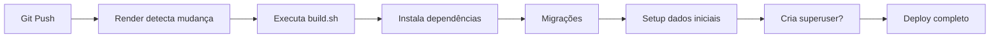

# 🚀 Arquivos de Deploy

Este diretório contém arquivos relacionados ao deploy da aplicação.

---

## 📁 Estrutura

```
deploy/
├── render.yaml        # Configuração do Render.com
└── scripts/
    └── build.sh       # Script de build
```

---

## 📄 Arquivos

### 🔧 [render.yaml](render.yaml)

Configuração completa para deploy automático no Render.com.

**Define:**
- Web service (Django + Gunicorn)
- PostgreSQL database
- Redis service
- Variáveis de ambiente
- Build e start commands

**Deploy automático:**
1. Conecte repositório Git no Render
2. O `render.yaml` é detectado automaticamente
3. Todos os services são criados

---

### 🛠️ [scripts/build.sh](scripts/build.sh)

Script executado durante o build no Render.

**Etapas:**
1. Instala dependências (`pip install`)
2. Coleta arquivos estáticos (`collectstatic`)
3. Cria migrações (`makemigrations`)
4. Aplica migrações (`migrate`)
5. **Popula dados iniciais** (`setup_initial_data`)
6. **Cria superusuário** (se `CREATE_SUPERUSER=true`)

---

## 🎯 Deploy no Render

### Opção 1: Deploy Automático (Recomendado)

1. Faça push do código para GitHub/GitLab
2. Conecte o repositório no Render
3. O `render.yaml` configura tudo automaticamente
4. Configure variáveis opcionais (OAuth, APIs)
5. Deploy!

### Opção 2: Deploy Manual

Ver [docs/deployment/DEPLOY_RENDER.md](../docs/deployment/DEPLOY_RENDER.md)

---

## ⚙️ Configuração de Variáveis

### Criar Superusuário Automaticamente

No painel do Render, em **Environment**:

```
CREATE_SUPERUSER=true
SUPERUSER_USERNAME=admin
SUPERUSER_EMAIL=seu@email.com
SUPERUSER_PASSWORD=SuaSenha123
```

### Outras Variáveis Importantes

```
# Site
SITE_DOMAIN=seu-app.onrender.com
SITE_NAME=Nome do Site

# OAuth (opcional)
GOOGLE_CLIENT_ID=...
GOOGLE_CLIENT_SECRET=...

# APIs (opcional)
GOOGLE_BOOKS_API_KEY=...
GEMINI_API_KEY=...
```

Ver [config/.env.example](../config/.env.example) para lista completa.

---

## 🔄 Workflow de Deploy



---

## 🛠️ Comandos Úteis

### Forçar Redeploy

No painel do Render:
- **Manual Deploy** > **Deploy latest commit**
- **Clear build cache & deploy** (rebuild completo)

### Ver Logs

- Painel Render > Seu serviço > **Logs**

---

## 📚 Documentação Relacionada

- **[Deploy no Render](../docs/deployment/DEPLOY_RENDER.md)** - Guia completo
- **[Guia Rápido Free](../docs/production/GUIA_RAPIDO_FREE.md)** - Para plano free
- **[Production Checklist](../docs/deployment/PRODUCTION_CHECKLIST.md)** - Checklist

---

**Última atualização:** Novembro 2025
