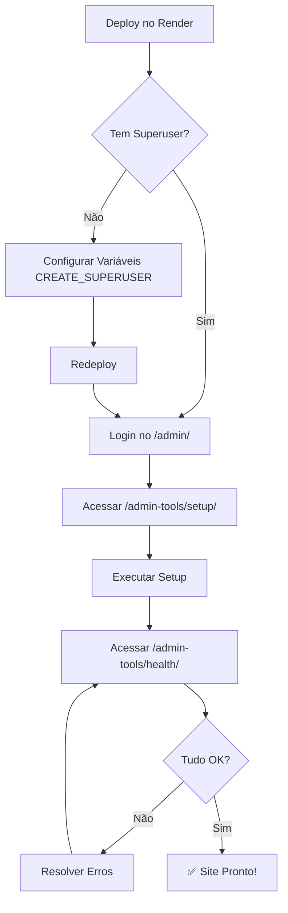

# 🚀 Guia Rápido - Render Free (SEM SHELL)

## ✅ Soluções Implementadas para Plano Free

Como o plano free do Render **NÃO tem acesso ao Shell**, criamos ferramentas WEB para você gerenciar tudo pelo navegador!

---

## 🎯 Ferramentas Disponíveis

### 1. Health Check (Diagnóstico)
**URL:** `https://cgbookstore-v3.onrender.com/admin-tools/health/`

**O que faz:**
- ✅ Verifica conexão com banco de dados
- ✅ Verifica conexão com Redis
- ✅ Verifica configuração do Site
- ✅ Verifica apps OAuth
- ✅ Verifica categorias e livros
- ✅ Verifica variáveis de ambiente
- ✅ Verifica configurações de segurança

**Como usar:**
1. Faça login no admin
2. Acesse a URL acima
3. Veja o relatório completo

---

### 2. Setup de Dados Iniciais
**URL:** `https://cgbookstore-v3.onrender.com/admin-tools/setup/`

**O que faz:**
- ✅ Cria Site (django-allauth)
- ✅ Cria 20 categorias de livros
- ✅ Cria 3 livros de exemplo
- ✅ Configura apps OAuth (Google e Facebook)

**Como usar:**
1. Faça login no admin
2. Acesse a URL acima
3. Clique no botão "Executar Setup"
4. Aguarde a conclusão

---

## 👤 Como Criar o Primeiro Superusuário

### Opção 1: Automático via Variáveis de Ambiente (RECOMENDADO)

**No painel do Render, em Environment:**

```
CREATE_SUPERUSER=true
SUPERUSER_USERNAME=admin
SUPERUSER_EMAIL=seu@email.com
SUPERUSER_PASSWORD=SuaSenhaSegura123
```

**Depois:**
1. Clique em **Manual Deploy** > **Deploy latest commit**
2. Aguarde o build
3. Faça login em `/admin/` com as credenciais configuradas
4. **IMPORTANTE:** Altere a senha após primeiro login!

---

### Opção 2: Via Registro Público (Temporário)

Se você tem um usuário comum criado:

1. Acesse o banco via painel do Render (Databases > PostgreSQL)
2. Execute query SQL:
   ```sql
   UPDATE auth_user
   SET is_staff = true, is_superuser = true
   WHERE username = 'seu_username';
   ```

⚠️ **ATENÇÃO:** Desabilite registro público depois!

---

## 🔧 Resolver Problemas Comuns

### ❌ PROBLEMA: Banco Vazio

**Sintoma:** Site sem categorias ou livros

**Solução:**
1. Crie superusuário (ver acima)
2. Acesse: `/admin-tools/setup/`
3. Clique em "Executar Setup"

---

### ❌ PROBLEMA: Erro CSRF (403)

**Sintoma:** Formulários não funcionam

**Solução no Painel Render (Environment):**
```
ALLOWED_HOSTS=cgbookstore-v3.onrender.com
CSRF_TRUSTED_ORIGINS=https://cgbookstore-v3.onrender.com
```

**IMPORTANTE:**
- `ALLOWED_HOSTS`: SEM `https://`
- `CSRF_TRUSTED_ORIGINS`: COM `https://`

---

### ❌ PROBLEMA: OAuth Não Funciona

**Solução:**

1. **Configurar credenciais no Render:**
   ```
   GOOGLE_CLIENT_ID=seu-client-id
   GOOGLE_CLIENT_SECRET=seu-secret
   FACEBOOK_APP_ID=seu-app-id
   FACEBOOK_APP_SECRET=seu-secret
   ```

2. **Executar setup via web:**
   - Acesse: `/admin-tools/setup/`
   - Clique em "Executar Setup"

3. **Configurar callback URLs:**
   - **Google:** `https://cgbookstore-v3.onrender.com/accounts/google/login/callback/`
   - **Facebook:** `https://cgbookstore-v3.onrender.com/accounts/facebook/login/callback/`

---

## 📋 Checklist Pós-Deploy

- [ ] **1. Criar Superusuário**
  - Opção 1: Variáveis de ambiente (recomendado)
  - Opção 2: Query SQL no banco

- [ ] **2. Popular Dados Iniciais**
  - Acessar: `/admin-tools/setup/`
  - Executar setup

- [ ] **3. Verificar Health Check**
  - Acessar: `/admin-tools/health/`
  - Resolver erros críticos

- [ ] **4. Configurar Variáveis OAuth (opcional)**
  - Google Client ID e Secret
  - Facebook App ID e Secret

- [ ] **5. Alterar Senha do Admin**
  - Acessar: `/admin/`
  - Mudar senha padrão

---

## 🎯 Fluxo Completo de Setup



---

## 🆘 Links Úteis

### Ferramentas Web
- 🏥 Health Check: `/admin-tools/health/`
- 🔄 Setup Dados: `/admin-tools/setup/`
- 🔐 Admin: `/admin/`

### Painel Render
- Dashboard: https://dashboard.render.com
- Environment: Configurar variáveis
- Logs: Ver erros e avisos
- Manual Deploy: Forçar redeploy

---

## 📚 Documentação Adicional

- **[CORRECOES_PRODUCAO.md](CORRECOES_PRODUCAO.md)** - Correções detalhadas
- **[TROUBLESHOOTING_PRODUCAO.md](TROUBLESHOOTING_PRODUCAO.md)** - Troubleshooting completo
- **[README_PRODUCAO.md](README_PRODUCAO.md)** - Visão geral

---

## 💡 Dicas

### Forçar Redeploy
1. Painel Render > Seu serviço
2. **Manual Deploy** > **Deploy latest commit**
3. OU: **Clear build cache & deploy** (rebuild completo)

### Ver Logs em Tempo Real
1. Painel Render > Seu serviço
2. **Logs**
3. Filtrar por: Error, Warning, Info

### Executar Comando Específico
Como não há Shell, você pode:
1. Criar uma view temporária em `admin_tools.py`
2. Acessar via URL
3. Remover depois

---

**🎉 Com essas ferramentas, você pode gerenciar tudo sem precisar do Shell!**
