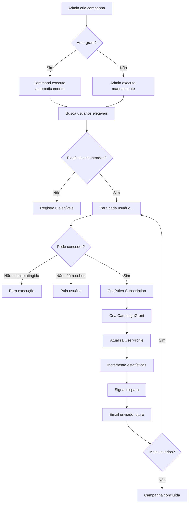

# 📢 Sistema de Campanhas de Marketing - Premium Gratuito

## 🎯 Visão Geral

Sistema completo para gerenciar campanhas de marketing que concedem **Premium gratuito** por períodos específicos (7, 15 ou 30 dias) para diferentes grupos de usuários de forma automática.

---

## ✨ Funcionalidades Principais

### 1. **Tipos de Campanhas Suportadas**

#### 🎁 **Individual**
Concede Premium para um usuário específico
- Busca por: ID, username ou email
- Ideal para: Prêmios, recompensas VIP

#### 👥 **Grupo de Usuários**
Concede para múltiplos usuários simultaneamente
- Lista de IDs ou usernames
- Limite de quantidade configurável
- Ideal para: Campanhas segmentadas

#### 🆕 **Novos Usuários**
Concede automaticamente para novos cadastros
- Filtro por data de cadastro
- Concessão automática via signal
- Ideal para: Onboarding, aquisição

#### 🎂 **Aniversariantes do Mês**
Concede para usuários no mês de aniversário
- Usa campo `birthday` do UserProfile
- Fallback: mês de cadastro
- Ideal para: Fidelização, engajamento

#### 🎯 **Critério Personalizado**
Filtros avançados customizáveis
- Usuários sem assinatura ativa
- Inativos há X dias
- Assinatura expirada
- Combinações múltiplas
- Ideal para: Reativação, win-back

---

## 🚀 Como Usar

### **1. Acessar o Admin**

Navegue até: `/admin/finance/campaign/`

### **2. Criar Nova Campanha**

Clique em **"Adicionar Campanha de Marketing"**

#### **Campos Obrigatórios:**

```
Nome: "Boas-vindas Premium 2025"
Descrição: "7 dias gratuitos para novos usuários"
Duração: 7 dias
Tipo de Público: Novos Usuários
Status: Ativa
Data Início: 2025-01-01 00:00
Data Término: 2025-12-31 23:59
```

#### **Configuração de Critérios (JSON):**

**Exemplo 1 - Novos Usuários (últimos 7 dias):**
```json
{
  "days_ago": 7
}
```

**Exemplo 2 - Usuário Individual:**
```json
{
  "username": "joao_silva"
}
```

**Exemplo 3 - Grupo de Usuários:**
```json
{
  "usernames": ["maria", "jose", "ana"],
  "limit": 3
}
```

**Exemplo 4 - Usuários Inativos:**
```json
{
  "inactive_days": 30,
  "no_active_subscription": true,
  "limit": 100
}
```

### **3. Executar Campanha**

#### **Opção A: Via Admin (Manual)**
1. Selecione a(s) campanha(s)
2. No menu "Ações", escolha:
   - **"Pré-visualizar usuários elegíveis"** → Preview
   - **"Executar campanhas selecionadas"** → Executa

#### **Opção B: Via Command (Automático)**

```bash
# Processa todas as campanhas ativas
python manage.py process_campaigns

# Preview (não concede, apenas mostra)
python manage.py process_campaigns --preview

# Processa campanha específica
python manage.py process_campaigns --campaign-id 1

# Apenas verifica expirados
python manage.py process_campaigns --check-expired
```

#### **Opção C: Automação com Cron**

Adicione ao crontab (Linux/Mac):
```bash
# Executa diariamente às 00:00
0 0 * * * cd /path/to/project && python manage.py process_campaigns
```

Windows Task Scheduler:
```batch
# Script: process_campaigns.bat
cd C:\ProjectsDjango\cgbookstore_v3
python manage.py process_campaigns
```

---

## 📊 Monitoramento e Estatísticas

### **No Admin - Lista de Campanhas**

Visualize:
- ✅ Status (Ativa, Pausada, Concluída)
- 📊 Total Concedido vs Elegível
- ⏳ Concessões Restantes
- 📅 Período de vigência

### **Concessões Individuais**

Navegue até: `/admin/finance/campaigngrant/`

Veja:
- 👤 Usuário que recebeu
- 📢 Campanha de origem
- 📅 Datas (concedido, expira, revogado)
- ✅ Status atual
- 📧 Se foi notificado

---

## 🎬 Fluxo de Funcionamento



---

## 🔧 Gestão de Campanhas

### **Actions Disponíveis (Admin)**

#### 1. **Ativar Campanhas**
Muda status para "Ativa"

#### 2. **Pausar Campanhas**
Suspende temporariamente (não concede mais)

#### 3. **Marcar como Concluídas**
Finaliza campanha permanentemente

#### 4. **Executar Campanhas**
Concede Premium para usuários elegíveis

#### 5. **Pré-visualizar Elegíveis**
Mostra quem receberia sem conceder

### **Revogação de Concessões**

#### **Manual:**
1. Vá em `/admin/finance/campaigngrant/`
2. Selecione concessões ativas
3. Ação: "Revogar concessões selecionadas"

#### **Automática:**
- Command `process_campaigns` verifica expirados
- Revoga automaticamente após data de expiração

---

## 📧 Notificações por Email (Futuro)

Sistema preparado para enviar:
- ✉️ Email de concessão (bem-vindo ao Premium)
- ⏰ Aviso de expiração em 3 dias
- 📅 Notificação de expiração

Implementar em: `finance/emails.py` (já preparado nos signals)

---

## 🧪 Exemplos de Casos de Uso

### **Caso 1: Campanha de Boas-vindas**
```
Nome: Boas-vindas 2025
Duração: 7 dias
Tipo: Novos Usuários
Critérios: {"days_ago": 1}
Auto-grant: Sim
```
**Resultado:** Todos os novos usuários ganham 7 dias automaticamente

---

### **Caso 2: Reativação de Inativos**
```
Nome: Volte para nós!
Duração: 15 dias
Tipo: Critério Personalizado
Critérios: {
  "inactive_days": 60,
  "no_active_subscription": true,
  "limit": 500
}
```
**Resultado:** Primeiros 500 inativos há 60+ dias ganham 15 dias

---

### **Caso 3: Aniversariantes**
```
Nome: Feliz Aniversário!
Duração: 30 dias
Tipo: Aniversariantes do Mês
Auto-grant: Sim
```
**Resultado:** Usuários do mês atual ganham 30 dias automaticamente

---

### **Caso 4: Prêmio VIP**
```
Nome: Cliente Fiel - João Silva
Duração: 30 dias
Tipo: Individual
Critérios: {"username": "joao_silva"}
Motivo: Cliente há 1 ano, sempre ativo
```
**Resultado:** João Silva ganha 30 dias personalizados

---

## ⚙️ Configurações Avançadas

### **Limite de Concessões**
- Defina `max_grants` para limitar quantidade
- `null` = ilimitado
- Útil para: Orçamento controlado

### **Concessão Automática**
- `auto_grant = True`: Command executa sozinho
- `auto_grant = False`: Apenas manual no admin

### **Período de Vigência**
- Campanhas fora do período são ignoradas
- Permite agendar campanhas futuras

---

## 🔒 Segurança e Auditoria

### **Registros Mantidos:**
- ✅ Quem criou a campanha (`created_by`)
- ✅ Quando foi concedido (`granted_at`)
- ✅ Quando expira (`expires_at`)
- ✅ Se foi revogado (`revoked_at`)
- ✅ Motivo da concessão (`reason`)

### **Restrição:**
- Usuário só pode receber **1x por campanha** (unique_together)
- Previne duplicação acidental

---

## 📈 Métricas e Relatórios

### **Por Campanha:**
- Total de elegíveis
- Total concedido
- Taxa de conversão (concedido/elegível)
- Concessões ativas vs expiradas

### **Globais:**
- Usuários Premium por campanha
- Campanhas mais efetivas
- Taxa de reativação

---

## 🐛 Troubleshooting

### **Problema: Campanha não executa automaticamente**
**Solução:**
- Verificar `status = 'active'`
- Verificar `auto_grant = True`
- Verificar período (start_date ≤ hoje ≤ end_date)
- Rodar command manualmente para debug

### **Problema: Usuários não são elegíveis**
**Solução:**
- Usar "Pré-visualizar elegíveis" para debug
- Verificar critérios JSON
- Verificar se já receberam antes

### **Problema: Concessões não expiram**
**Solução:**
- Rodar command com `--check-expired`
- Configurar cron para execução diária

---

## 📚 Arquivos Importantes

```
finance/
├── models.py                    # Campaign, CampaignGrant
├── services.py                  # CampaignService
├── signals.py                   # Automação (novos usuários)
├── admin.py                     # Interface administrativa
├── management/
│   └── commands/
│       └── process_campaigns.py # Command automático
└── migrations/
    └── 0002_campaign_campaigngrant.py
```

---

## 🚦 Status do Sistema

✅ **Implementado e Funcional:**
- Modelos Campaign e CampaignGrant
- CampaignService (lógica completa)
- Signals de sincronização
- Admin interface com actions
- Management command
- Migrations aplicadas

🔄 **Pendente (Opcional):**
- Sistema de emails (estrutura pronta)
- Dashboard de analytics
- A/B testing de campanhas

---

## 💡 Dicas de Uso

1. **Sempre teste em Preview** antes de executar campanhas grandes
2. **Configure cron** para automação completa
3. **Monitore estatísticas** regularmente
4. **Use motivo/reason** para rastreabilidade
5. **Defina limites** para controlar custos

---

## 📞 Suporte

Para dúvidas ou problemas:
1. Verifique os logs: `finance/logs/`
2. Consulte este README
3. Execute command com `--preview` para debug

---

**Desenvolvido com ❤️ para CGBookStore v3**
*Sistema de Campanhas de Marketing - v1.0*
